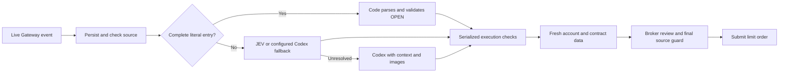

# Fast entry rules, JEV, and Codex fallback

Local verification completed on September 21, 2026. The regression suite passed all 484 tests, including the real HTTP key-save flow and broker read-scope checks. A subsequent focused run passed 39 checks, including an added off-thread startup-calendar regression. Tests did not use a live trade or model-provider call. Local parsing results and simulated broker delays do not establish live submission latency.

## Routing boundaries

1. **Direct code:** a recognized literal entry with exactly one contract and premium, no unsupported clause, and sufficient explicit facts returns a validated OPEN decision immediately. The current schemas cover clean structured ENTRY cards and complete supported OPEN/BUY text. No model lock, request, or token is involved.
2. **JEV:** a bounded candidate with complete text facts but intent requiring interpretation can use the configured JEV fallback. Native confidence, selected probability, and action/evidence eligibility must meet their configured thresholds. Eligible entry attempts have a 700 ms ceiling, including slot waiting; other JEV attempts use the configured deadline, up to 1,200 ms.
3. **Codex:** missing or contradictory facts, screenshot-dependent contracts, unsupported compound actions, unresolved references, schema failures, timeout, or uncertain JEV output use the subscription-backed evaluator. Recovery assessment remains Codex-only.

A direct entry uses positive template matching. Extra comments, unparsed stop or sizing instructions, cancellation, historical/quoted content, conflicting contracts/prices, missing call/put, and incomplete fields do not become buys through a loose keyword match. Current text must independently establish the intended entry. An unrelated earlier image does not invalidate complete current text. An image that may supply a missing expiry or other necessary fact requires image-capable interpretation.

Omitted entry expiry retains the source-date 0DTE/next-listed rule. Only the execution engine resolves the available expiry; no duplicate broker discovery is needed before model interpretation. Exits must identify the exact held contract and expiry. A defaulted exit is not promoted into a new contract.

The normalizer and existing engine still enforce configured channel/author permissions, live versus baseline/edited history, source revision/chronology, durable duplicate claims, and inventory ownership. Direct parsing does not grant authority to arbitrary Discord content or change the broker mode.

## Configuration and frontend

`evaluation.direct_entries` defaults to `true` and is exposed as **Direct entries** in Setup. Disable it to use the selected evaluator for every interpretation. The existing `evaluation.mode` selects Codex fallback, JEV with Codex fallback, or JEV shadow. **JEV shadow always keeps Codex authoritative**, including messages that otherwise qualify for direct entry.

JEV credentials remain optional for direct code. When JEV is selected, its TypeSafe credential is stored privately through Setup or provided by the existing environment variables. Codex continues using the ChatGPT subscription. Missing model authorization does not prevent a complete direct entry from being interpreted; an ambiguous message still requires a usable fallback and reports authorization failures normally.

Parsing confidence describes certainty about the explicit instruction. It is not a forecast of trading profit and does not become a Kelly win probability. Direct entries supply 1.0 parsing confidence, selecting the upper configured confidence-sizing reference before the other deterministic sizing adjustments. Existing affordability, maximum chase, whole-contract trim rounding, and expiry-protection rules continue to run.

## Execution and timing

The direct route does not wait for the Codex lock. A fresh account snapshot starts alongside missing-expiry discovery. Expiry lookup requests the earliest eligible listed date first, advancing only if the exact strike/type is unavailable; it checks all matching chains and rejects ambiguity. It does not fetch every later expiry before selecting the nearest one.

Broker reads have a task-local scope covering one serialized decision. Just-resolved contract metadata passes to its first quote lookup. Successful account and quote reads may be reused for at most one second after completion within that scope, subject to their original timestamp checks; the cache does not reset their age. This removes repeated planning-to-submission reads without retaining completed prices or balances for later decisions. Failures, cancellation, completion, or a broker mutation invalidate the scope. Reads outside that scope retain their existing behavior. Position reads and chain lookups use bounded concurrency, and overlapping portfolio requests share only the currently running fetch.

The exchange calendar is initialized in a background thread during broker startup, before signal processing. Market-session checks still run at decision and submission time. A local cold calendar call took 1.057 seconds versus 0.000115 seconds once initialized; those are CPU measurements, not broker-response measurements.

An offline comparison of the same nearest-expiry entry through a fixture broker reduced the request count from 18 to 9. With a simulated 150 ms delay per request and calendars initialized for both versions, elapsed time through the simulated submission fell from 1.372 to 0.758 seconds. This excludes Discord source verification and real provider variability; it is a request-graph regression check, not a live latency claim.

Live execution performs its authoritative source verification at the final pre-submit boundary after broker review, with local checks before and after. A changed source, kill switch, stale quote, account restriction, reduced affordability, excessive chase, or uncertain previous order still prevents placement. Cancellation drains pending reads. The existing order ledger and idempotency rules remain authoritative.

The dashboard distinguishes rules, JEV, and Codex and displays:

- receipt and queue delay;
- rule/model interpretation time;
- expiry discovery, fresh snapshot, quote, and execution wait;
- receipt-to-submission and posted-to-submission when the final placement boundary is reached;
- broker response time/status separately from acceptance or exchange fills.

Missing measurements remain unavailable, not zero. Fast-path coverage includes direct decisions and JEV separately.

Fastest arrival requires the event-driven Gateway transport. New example configurations select Gateway. Existing saved transports are preserved; browser polling defaults to three seconds and cannot supply subsecond arrival. Required remote account, quote, review, and submission work remains outside local parser control. The one-second objective is an operational target, not a proven provider execution guarantee or a reason to skip those checks.

## Observed-message qualification

The September 20 audit found the previous implementation admitted zero actionable decisions from the original exports. The corrected rules were replayed against all 196 messages with the actual shared-context selector. Exactly the expected 12 clean structured entries and one complete plain entry qualify directly. The contradictory watching comment and other unsupported instructions remain outside direct execution.

After those 13 direct entries, 24 messages qualify for a bounded JEV attempt: seven OPEN candidates and 17 WAIT candidates. The other 159 require Codex. These are routing counts, not measured model accuracy or successful trades. Across 1,300 local parser calls, the measured median was 0.038 ms, p95 0.088 ms, p99 0.153 ms, and maximum 0.246 ms; broker and network work are excluded.

Private source exports, exact message examples, and detailed replay evidence are retained locally and excluded from the public repository. Local replay verifies parsing and routing; it does not establish model accuracy, current holdings, live latency, or fills.

## Provider contract references

The native TypeSafe choice contract and authentication were verified against its primary documentation on September 18, 2026:

- [Native quick start](https://docs.typesafe.ai/introduction/quickstart.md)
- [Choice questions and confidence](https://docs.typesafe.ai/primitives/choice.md)
- [State input](https://docs.typesafe.ai/concepts/state.md)

See the [setup guide](container.md#jev-fast-evaluation) for the frontend workflow.
